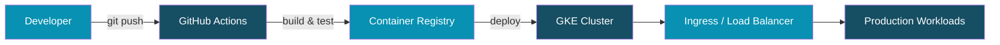

<div align="center">

<!-- Animated header banner -->


<!-- Typing animation -->


<br />


<b>Hi, I'm Peerapat — welcome to my profile</b>

<br /><br />

[](mailto:peer.forwork@gmail.com)
[](https://www.linkedin.com/in/peerapat-sukkasem-6769a924a/)
[](https://github.com/AtlastZ)


</div>

---

### 🖥️ Terminal


---

### 📊 GitHub Analytics

<div align="center">


<br />


</div>

---

### 🐍 Contribution Snake

<div align="center">

<picture>
  <source media="(prefers-color-scheme: dark)" srcset="https://raw.githubusercontent.com/AtlastZ/AtlastZ/output/github-contribution-grid-snake-dark.svg">
  <source media="(prefers-color-scheme: light)" srcset="https://raw.githubusercontent.com/AtlastZ/AtlastZ/output/github-contribution-grid-snake.svg">
  
</picture>

</div>

---

### 🏆 Trophies & Languages

<div align="center">


<br /><br />


</div>

---

### About Me

```yaml
name: Peerapat Sukkasem
role: Infra | Platform Engineer
location: Thailand
currently_learning: Kube-Cluster Deployment
interests: [Cloud, DevOps, Automation, Linux]
```

---

### 🛠 Tech Stack

<div align="center">


</div>

<br />

<details open>
<summary><b>Skill levels</b></summary>
<br />

```
Docker          ████████░░  80%
Linux / Bash    ████████░░  80%
Git / GitHub    ███████░░░  70%
GCP             ██████░░░░  60%
Kubernetes      ██████░░░░  60%
GitHub Actions  ██████░░░░  60%
Terraform       █████░░░░░  50%
Arduino         ████░░░░░░  40%
```

</details>

<details>
<summary><b>More tools & platforms</b></summary>
<br />

<p align="center">
  
  
  
  
  
  
</p>

</details>

---

### 🚀 Featured Projects

> 🚧 Repositories coming soon — here's what I'm building toward

<div align="center">

| Project | Status | Stack |
|:--------|:------:|:------|
| **Kube-Cluster Deployment** | 🔨 In Progress | Kubernetes, GCP, Helm |
| **Platform Automation Toolkit** | 📋 Planned | Docker, Bash, GitHub Actions |
| **CI/CD Pipeline Templates** | 📋 Planned | GitHub Actions, Docker |

</div>

<br />

<details>
<summary><b>🏗 Target architecture — Kube-Cluster Deployment</b></summary>
<br />



</details>

---

### 🎯 Learning Path

> Certifications & credentials — work in progress

<div align="center">

| Goal | Status |
|:-----|:------:|
| Google Cloud Associate Cloud Engineer | 📖 Studying |
| Certified Kubernetes Administrator (CKA) | 🎯 Planned |
| Docker Certified Associate (DCA) | 🎯 Planned |

<br />


</div>

---

### Connect

<div align="center">

<a href="https://discord.com/users/reibiellia" target="_blank">
  
</a>
<a href="https://www.facebook.com/peerapat.suk.1/" target="_blank">
  
</a>
<a href="http://www.instagram.com/peerapat.suk" target="_blank">
  
</a>
<a href="https://www.linkedin.com/in/peerapat-sukkasem-6769a924a/" target="_blank">
  
</a>

</div>

<br />

<div align="center">
  
</div>
