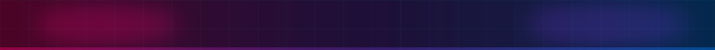
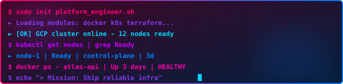
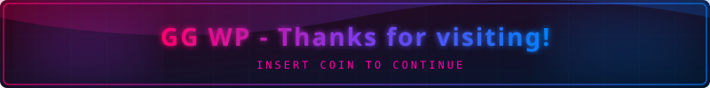

<div align="center">

<!-- ═══════════════════ RGB HERO + DYNAMIC BACKGROUND ═══════════════════ -->


<br />


<br />

[](mailto:peer.forwork@gmail.com)
[](https://www.linkedin.com/in/peerapat-sukkasem-6769a924a/)
[](https://github.com/AtlastZ)

<br /><br />


</div>




##  `SYSTEM TERMINAL`

<div align="center">



</div>


## 🐍 `CONTRIBUTION SNAKE — HIGH SCORE RUN`

<div align="center">

<picture>
  <source media="(prefers-color-scheme: dark)" srcset="https://raw.githubusercontent.com/AtlastZ/AtlastZ/output/github-contribution-grid-snake-dark.svg">
  <source media="(prefers-color-scheme: light)" srcset="https://raw.githubusercontent.com/AtlastZ/AtlastZ/output/github-contribution-grid-snake.svg">
  
</picture>

</div>


## 🏆 `ACHIEVEMENTS UNLOCKED`

<div align="center">


<br /><br />


<br /><br />


</div>


## 👾 `PLAYER CARD`

```diff
+ ╔══════════════════════════════════════════╗
+ ║  CODENAME    │  Peerapat Sukkasem        ║
+ ║  CLASS       │  Infra | Platform Engineer║
+ ║  REGION      │  Thailand 🇹🇭              ║
+ ║  CURRENT Q   │  Kube-Cluster Deployment  ║
+ ║  BUFFS       │  Cloud · DevOps · Linux   ║
+ ╚══════════════════════════════════════════╝
```


## ⚔️ `LOADOUT — TECH STACK`

<div align="center">


</div>

<br />

<details open>
<summary><b>🎮 SKILL TREE — XP LEVELS</b></summary>
<br />

```
Docker          ████████░░  LVL 80  ⚡ MASTER
Linux / Bash    ████████░░  LVL 80  ⚡ MASTER
Git / GitHub    ███████░░░  LVL 70  🔥 ELITE
GCP             ██████░░░░  LVL 60  💎 ADVANCED
Kubernetes      ██████░░░░  LVL 60  💎 ADVANCED
GitHub Actions  ██████░░░░  LVL 60  💎 ADVANCED
Terraform       █████░░░░░  LVL 50  🎯 SKILLED
Arduino         ████░░░░░░  LVL 40  📡 RISING
```

</details>

<details>
<summary><b>🗃️ INVENTORY — MORE TOOLS</b></summary>
<br />

<p align="center">
  
  
  
  
  
  
</p>

</details>


## 🚀 `ACTIVE QUESTS`

> ⚡ Side missions loading — here's the main storyline

<div align="center">

| 🎯 Quest | Status | Loadout |
|:---------|:------:|:--------|
| **Kube-Cluster Deployment** | 🔴 IN PROGRESS | Kubernetes, GCP, Helm |
| **Platform Automation Toolkit** | 🟡 QUEUED | Docker, Bash, GitHub Actions |
| **CI/CD Pipeline Templates** | 🟡 QUEUED | GitHub Actions, Docker |

</div>

<br />

<details>
<summary><b>🗺️ QUEST MAP — Kube-Cluster Deployment</b></summary>
<br />



</details>


```mermaid
graph LR
    A[🎮 Developer] -->|git push| B[⚡ GitHub Actions]
    B -->|build & test| C[📦 Container Registry]
    C -->|deploy| D[☸️ GKE Cluster]
    D --> E[🌐 Ingress / LB]
    E --> F[🏆 Production Workloads]

    style A fill:#ff006e,color:#fff,stroke:#00d4ff,stroke-width:2px
    style B fill:#8338ec,color:#fff,stroke:#ff00aa,stroke-width:2px
    style C fill:#0080ff,color:#fff,stroke:#bf00ff,stroke-width:2px
    style D fill:#00d4ff,color:#0a0a0f,stroke:#8338ec,stroke-width:2px
    style E fill:#bf00ff,color:#fff,stroke:#0080ff,stroke-width:2px
    style F fill:#0a0a0f,color:#00d4ff,stroke:#ff006e,stroke-width:2px
```

## 🎯 `BOSS FIGHTS — CERTIFICATIONS`

> 🏅 Raid bosses ahead — grinding XP

<div align="center">

| Boss | Status |
|:-----|:------:|
| Certified Kubernetes Application Developer (CKAD) | 🔒 LOCKED — Target acquired |
| Docker Certified Associate (DCA) | 🔒 LOCKED — Target acquired |

<br />


</div>


## 📡 `MULTIPLAYER — CONNECT`

<div align="center">

<a href="https://discord.com/users/reibiellia" target="_blank">
  
</a>
<a href="https://www.facebook.com/peerapat.suk.1/" target="_blank">
  
</a>
<a href="http://www.instagram.com/peerapat.suk" target="_blank">
  
</a>
<a href="https://www.linkedin.com/in/peerapat-sukkasem-6769a924a/" target="_blank">
  
</a>

</div>

<br />

<div align="center">



</div>
